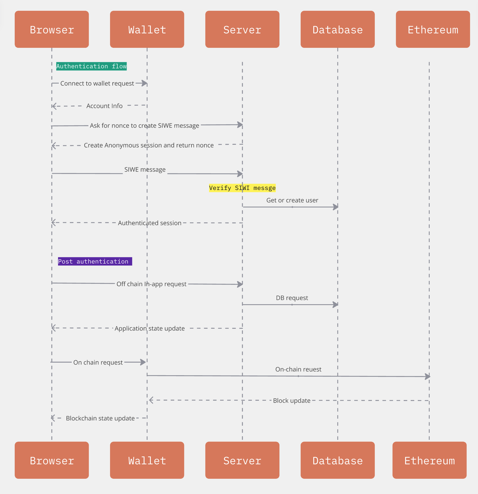

# Single Sign-on with Ethereum - dApp monorepo example with Nx, Next.js, Hardhat

This is a Nx repo to build a full-stack dApp with Next.js and Solidity. Technologies used in the app is:

**Frontend**

- Next.js
- Wagmi
- siwe (SIWE message management).
- iron-session (anonymous session management).
- Next UI for react components.
- Tailwind CSS.

**Backend**

- Next.js
- iron-session (anonymous session management).
- Auth.js (authentication & authorised session management).
- Drizzle ORM

**Infrastructure**

- Nx for monorepo management.
- Hardhat for contract development.
- Turso for cloud sqlite database
- Alchemy for Ethereum testnet
- Vercel for deployment.

[Deployed app](https://siwe-dapp-nx-nextjs-hardhat.vercel.app/)

## (1) Application architecture

Authentication and API flow diagram:



Another diagram for SSO flow:


How application works:


## (2) Get started

You need an account for Turso (for database), Alchemy (for testnet), and ethereum wallet (e.g. Metamask, Coinbase Wallet etc). Make sure to add `.env` in `apps/next-gb` and fill all the values from `.env.example`.

```bash
# for next js
yarn install
yarn nx dev # start app

yarn dev:node # start local ethereum node
yarn nx compile hardhat-gb
yarn nx test hardhat-gb
yarn nx deploy:character hardhat-gb # deploy to the local node
yarn nx deploy:character:alchemy-sepolia hardhat-gb # deploy to alchemy testnet
```

See

## REREFENCE

[Setting up this repo](/docs/1-setting-up-this-repo.md)
