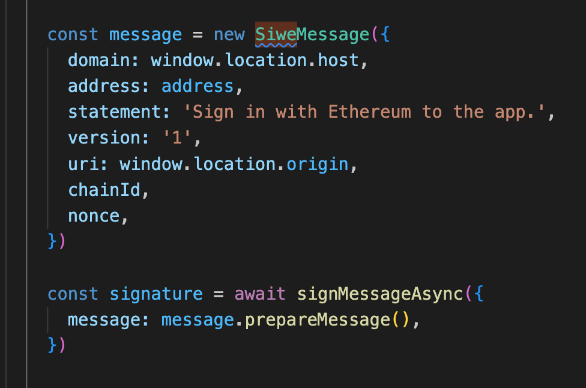
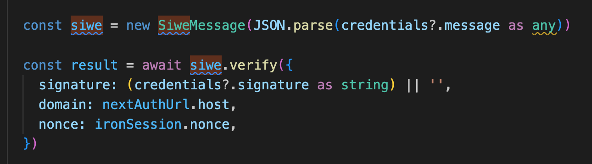

# Notes

## SSO solution design

### Authentication and Authenticated session management

We use `Auth.js` for authentication with custom logic. Once it's authenticated, Auth.js can manage the session.

### SIWE (Sign-In with Ethereum)

https://docs.login.xyz/general-information/siwe-overview/eip-4361

#### High-level flow in the code

1. Creating SIWE message



2. Verifying SIWE message backend



**Flow**


## Terminologies

**iron-session**

A Secure, stateless and cookie-based session library. https://github.com/vvo/iron-session

**Nonce**

In blockchain, a nonce is a randomly generated number that is included in the block's header. The purpose of the nonce is to add randomness to the block's hash, making it difficult for miners to find a valid hash value that meets the network's difficulty requirements.

[Nonce in cryptography](https://en.wikipedia.org/wiki/Cryptographic_nonce)

Nonce in cryptography means “number once,” and this arbitrary number is only used one time in a cryptographic communication. A nonce often includes a timestamp, which means it is only valid during a specific amount of time, to help ensure that it is only used once.

## REFERENCE

[Wagmi SIWE example with NextJs](https://1.x.wagmi.sh/examples/sign-in-with-ethereum) -> `withIronSessionApiRoute` is deprecated (https://github.com/vvo/iron-session/issues/679)

```json
{
  "heroType": "magician",
  "properties": [12, 23, 13, 11, 10],
  "level": 3
}
```

```text
x0.... 00 010010 010110 011111 011110 001101 11
```
